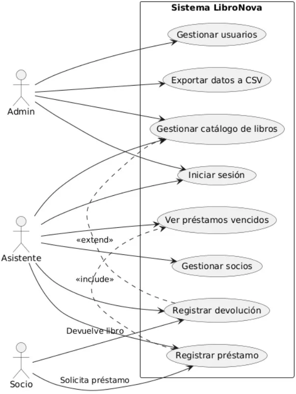
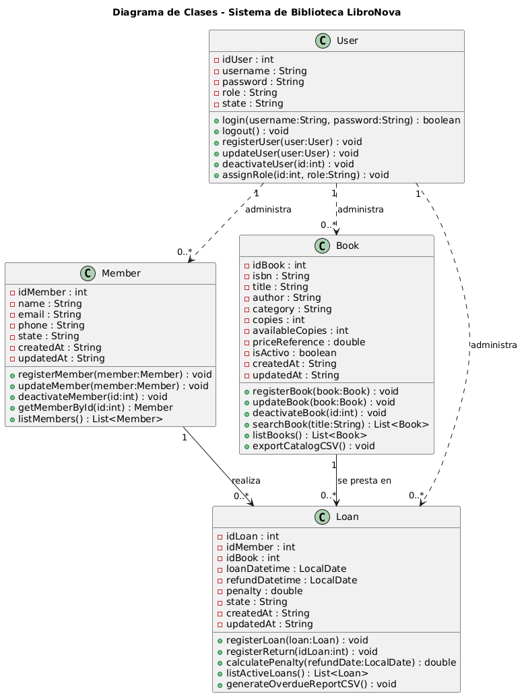

# LibroNova Library Management System

## 📌 Description
LibroNova is a **Java-based library management system** designed to manage users, books, loans, and generate reports for overdue books.  
The system supports **role-based access** (ADMIN and ASSISTANT) and provides an interactive GUI using `JOptionPane`.

---

## 🛠 Technologies Used
- **Java 17+** – Programming language  
- **Maven** – Build and dependency management  
- **MySQL** – Relational database  
- **JOptionPane** – GUI dialogs for user interaction  
- **Draw.io / Lucidchart** – For diagrams and modeling  

---

## ⚙️ Prerequisites
Before running the application, ensure you have installed:

1. **Java 17+**
2. **Maven**
3. **MySQL Server** (with the database created and tables initialized)

---

## 🚀 Setup & Execution

1. Clone the repository:
```bash
git clone https://github.com/RiveraMg/LibroNova.git
```
## Create the database:

The database script is located in the /db folder:
`name: SQLdatabase` 


## Credentiales to role
Rol : admin 
username: admin - password: admin123

rol: assistent
username: jonh - password: jonh123

## 📄 Class diagram


## 📄 Usage class diagram
  

## 👤 Developer Info
**Name:** Melanie Rivera Girón  
**Email:** riveramelanie720@gmail.com
